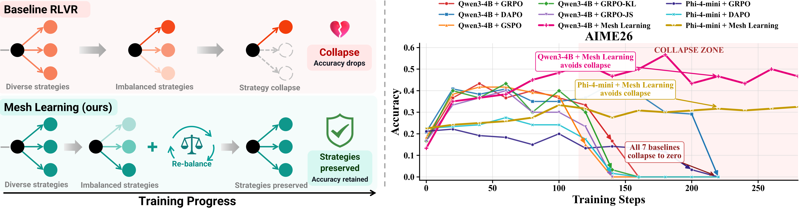
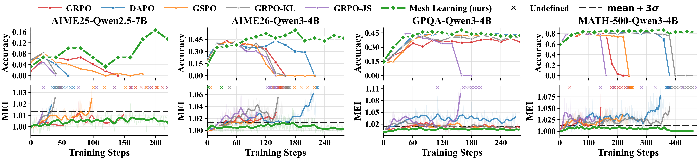

<div align="center">

# Mesh Learning

### Understanding and Preventing Catastrophic Strategy Collapse in RLVR

**Preserve reasoning strategies. Sustain learning. Anticipate collapse.**

Code and data for *All Work and No Play Makes Jack a Dull Boy: Understanding and Preventing Catastrophic Strategy Collapse in RLVR*.

[Theory](#why-rlvr-collapses) · [Method](#mesh-learning-expose-and-preserve) · [Results](#results-stability-and-stronger-reasoning) · [Reproduce](#reproduction-guide)

</div>

<p align="center">
  
</p>

<p align="center"><em>Baseline RLVR progressively loses viable strategies. Mesh Learning preserves multiple reasoning approaches and sustains accuracy in the reported experiments.</em></p>

| Qwen family | Phi family | Larger inference budgets |
| :---: | :---: | :---: |
| **Up to +13.4 pp** Mean@4 | **Up to +11.5 pp** Mean@4 | **Up to +32.6 pp** Pass@128 |
| AIME26 · Qwen3-4B | GPQA-Diamond · Phi-4-mini-reasoning | AIME26 · Qwen3-4B |

Gains are absolute percentage points over the strongest standard RLVR baseline in each reported setting. Mean@4 and Pass@128 measure different aspects of performance.

> **Our central finding:** successful reasoning requires sufficient strategy capacity, while standard RLVR optimization tends to concentrate that capacity. Preserving strategies is a principle for stable and effective RLVR.

## Why RLVR Collapses

Why can a model improve for many training steps and then abruptly lose its reasoning ability? Our theory connects **trajectory-level update interactions**, **strategy competition**, and **the information capacity required for accuracy**.

### From trajectories to strategies

We define strategies through optimization behavior. Trajectories belong together when they are positively coupled and have identical neighborhoods under a coupling-profile similarity criterion. Their coupling is measured by the inner product of their Fisher scores:

$$
U_i = \nabla_\theta \log \pi_\theta(\tau_i \mid Q),
\qquad K_{ij} = U_i^\top U_j.
$$

An update that reinforces one trajectory can reinforce or suppress another, depending on this coupling. The definition is grounded in policy dynamics; empirical analysis connects these groups to human-recognizable solution methods.

### Three theoretical results, one collapse mechanism

| Result | What the paper establishes | Why it matters |
| --- | --- | --- |
| **1 · Strategy concentration** | Under the stated optimization and scale assumptions, GRPO, DAPO, and GSPO concentrate almost all strategy mass onto one strategy with high probability within a finite validity horizon. | Different RLVR recipes share a tendency to contract effective strategy capacity. |
| **2 · Strategy capacity lower bound** | Within the analyzed regime, usable strategy capacity obeys $\lvert\widehat{S}_{\epsilon,k}\rvert = \Omega_\rho(m_\epsilon N P_{\mathrm{acc},k})$. | Maintaining nontrivial accuracy requires sufficient usable strategy capacity. |
| **3 · Limits of divergence penalties** | For either direction of KL and for JS, a sufficiently large reward gap relative to a fixed penalty strength can make the optimal strategy distribution arbitrarily concentrated. | Fixed divergence penalties cannot universally guarantee strategy preservation. |

**The conflict explains the accuracy cliff:** optimization contracts the available strategies, while accurate reasoning requires a minimum capacity. Once that capacity becomes insufficient, performance cannot be sustained in the analyzed regime.

The theorems are conditional: the concentration result assumes vanilla gradient descent, step-wise old-policy refresh, nontrivial accuracy, and specified learning-rate, clipping, and trajectory-length scales. It does not assert that every practical RLVR run must collapse.

### MEI: an online warning signal

The **Mirrored Entanglement Index (MEI)** measures alignment among trajectory logit gradients $v_i = \nabla_z \log \pi(\tau_i \mid Q)$:

$$
\mathrm{MEI} =
\frac{\left\lVert\sum_{i=1}^{G} v_i\right\rVert_2^2}
{\sum_{i=1}^{G}\lVert v_i\rVert_2^2}.
$$

Weakly coupled trajectories have a baseline near 1; increasing alignment raises MEI. Derived from rollout logits, the monitor requires no auxiliary training and avoids explicitly tracking parameter-space gradients. In the reported experiments, MEI crosses a calibrated **mean + $3\sigma$** threshold before the eventual accuracy cliff.

The paper calibrates **1.013** on pre-RLVR Qwen models across three datasets. New models and tasks should be calibrated against their own non-collapsed reference regime.

## Mesh Learning: Expose and Preserve

Mesh Learning combines two complementary components on top of GRPO:

| Component | Mechanism | Purpose |
| --- | --- | --- |
| **Coach Prompting (CP)** | An offline Coach LLM generates four distinct strategy prefixes per query. The policy assesses each suggestion and explores alternatives; prefixes exclude calculations, intermediate solutions, and final answers. | Expose multiple candidate reasoning strategies during training. |
| **Strategy-Balancing Regularization** | Balance strategy growth relative to a fixed pre-RLVR reference policy. | Prevent a fast-growing strategy from overwhelming the others while allowing joint improvement. |

For strategy scores $z$ and reference scores $z^{\mathrm{ref}}$, the paper defines:

$$
\mathcal{L}_{S} = D_{\mathrm{KL}}\!\left(U_m\,\middle\|\,\operatorname{softmax}(z-z^{\mathrm{ref}})\right),
\qquad
\mathcal{L} = \mathcal{L}_{\mathrm{RLVR}} + \mu\mathcal{L}_{S}.
$$

Each strategy score averages the log-probabilities of its correct trajectories. Comparing against the reference balances **relative learning progress**; adding the same improvement to every strategy leaves the regularizer unchanged.

**No Coach LLM is needed at inference.** The policy proposes its own candidate strategy and applies the verification procedure. Coach-provided tokens are masked from the training loss.

## Results: Stability and Stronger Reasoning

<p align="center">
  
</p>

<p align="center"><em>Top: reasoning accuracy. Bottom: MEI. Dashed lines mark the calibrated warning threshold; crosses mark undefined MEI. Mesh Learning sustains accuracy and maintains low MEI across the displayed tasks.</em></p>

### Main reasoning benchmarks

With four strategies, Mesh Learning achieves the best result across all eight Qwen model–benchmark settings in the main comparison.

| Model | AIME26 | AIME25 | MATH-500 | GPQA-Diamond |
| --- | ---: | ---: | ---: | ---: |
| Qwen2.5-7B-Instruct · strongest standard baseline | 10.0 | 13.3 | 71.8 | 34.3 |
| **Qwen2.5-7B-Instruct · Mesh Learning** | **13.3 (+3.3)** | **16.7 (+3.4)** | **73.4 (+1.6)** | **36.7 (+2.4)** |
| Qwen3-4B · strongest standard baseline | 43.3 | 43.3 | 84.3 | 45.8 |
| **Qwen3-4B · Mesh Learning** | **56.7 (+13.4)** | **48.3 (+5.0)** | **86.8 (+2.5)** | **47.9 (+2.1)** |
| Phi-4-mini-reasoning · strongest standard baseline | 25.0 | 24.1 | 79.9 | 23.0 |
| **Phi-4-mini-reasoning · Mesh Learning** | **33.3 (+8.3)** | **30.8 (+6.7)** | **83.2 (+3.3)** | **34.5 (+11.5)** |

Values are **Mean@4 accuracy (%)**; parentheses show absolute gains in percentage points. The strongest baseline is selected separately for each cell: GRPO, DAPO, GSPO, GRPO+KL, and GRPO+JS for Qwen, and GRPO/DAPO for Phi. Results come from Tables 1 and 2 in the paper.

### Larger inference budgets and coding

- **A stronger reasoning frontier:** at Pass@128, gains reach **+32.6 pp on AIME26** and **+28.8 pp on AIME25** for Qwen3-4B; Qwen2.5-7B-Instruct gains **+6.9 pp** and **+7.3 pp**, respectively.
- **Transfer to coding:** on LiveCodeBench v6, Mesh Learning reaches **65.3%** for Qwen3-4B and **36.3%** for Phi-4-mini-reasoning, improving over DAPO by **4.1 pp** and **3.6 pp** (Mean@4).
- **Preservation drives the gains:** controlled ablations give the same Coach prefixes to CP variants. CP alone brings little or no improvement, while combining CP with Strategy-Balancing Regularization consistently performs better.

---

## Reproduction Guide

Run commands from the repository root. The supplied launchers use **CUDA, FSDP, and SGLang**; choose GPU counts and memory settings for your hardware.

### 1. Install the environment

Install `uv` first, then create the environment:

```bash
uv venv --python 3.12 .venv
source .venv/bin/activate

uv pip install --upgrade pip setuptools wheel
uv pip install -e ./verl
uv pip install -r verl/requirements.txt
uv pip install -r verl/requirements-cuda.txt
uv pip install -r verl/requirements_sglang.txt

python -c "import verl; print('verl import ok')"
```

Match PyTorch, FlashAttention, and the rollout backend to your CUDA and driver versions. The repository also contains `verl/requirements-npu.txt` for NPU setups, but the launchers below explicitly set `trainer.device=cuda` and require adaptation for NPU execution.

### 2. Prepare models and datasets

Experiments use **Qwen/Qwen3-4B**, **Qwen/Qwen2.5-7B-Instruct**, and **unsloth/Phi-4-mini-reasoning**. Download the corresponding checkpoint and set `MODEL_PATH` to its local directory.

**Dataset release:** training and evaluation artifacts will be published on Hugging Face. The dataset link will be added here when available. Place the downloaded files under `data/`, or set the dataset paths explicitly.

| Benchmark | Evaluation file(s) | Standard training file | Coach-augmented training file |
| --- | --- | --- | --- |
| AIME25 / AIME26 | `AIME25_fixed.parquet`, `AIME26_fixed.parquet` | `dapomath_7000_not_enhanced.parquet` | `dapomath_7000_final_aligned.parquet` |
| MATH-500 | `MATH-500_fixed.parquet` | `math_train_fixed.parquet` | `math_final_aligned2.parquet` |
| GPQA-Diamond | `GPQA_diamond.parquet` | `WildSci_not_enhanced.parquet` | `WildSci_final_aligned_3.parquet` |
| LiveCodeBench v6 | `livecodebench.parquet` | `Skywork_not_enhanced.parquet` | `Skywork_final_aligned2.parquet` |

Coach-augmented datasets contain the prepared strategy prefixes. If using files tracked with Git LFS in this repository, fetch the actual data before training:

```bash
git lfs install
git lfs pull --include="data/*.parquet"
```

### 3. Launch Mesh Learning

The following example launches Qwen3-4B on the AIME26/AIME25 setting using the released GRPO script. Replace the model path and adjust the GPU count as needed:

```bash
MODEL_PATH=/path/to/Qwen3-4B \
TRAIN_PATH="$(pwd)/data/dapomath_7000_final_aligned.parquet" \
TEST_PATH="$(pwd)/data/AIME26_fixed.parquet" \
TEST_PATH_2="$(pwd)/data/AIME25_fixed.parquet" \
PROJECT_NAME=Mesh-Learning \
TRAINER_NAME=Qwen3-4B-Mesh-AIME \
N_GPUS_PER_NODE=2 \
TOTAL_EPOCHS=2 \
MAX_RESPONSE_LENGTH=8192 \
PPO_MAX_TOKEN_LEN_PER_GPU=10000 \
LOG_PROB_MAX_TOKEN_LEN_PER_GPU=10000 \
ROLLOUT_N=4 \
VAL_N=4 \
USE_KL_LOSS=False \
DIVERGENCE_TYPE=kl \
UNIFORM_GROUP_KL_ENABLE=True \
UNIFORM_GROUP_KL_GROUP_SIZE=4 \
WANDB_MODE=offline \
bash verl/examples/grpo_trainer/run_qwen2_5_7b_grpo.sh
```

**Rollout budget:** four Coach-augmented prompts represent the same query with different strategy prefixes. `ROLLOUT_N=4` produces four responses per prefix, totaling **16 rollouts per original query**. An unaugmented baseline uses `ROLLOUT_N=16` to match that budget.

The launchers log to the console and W&B. The example uses offline W&B logging; for online logging, authenticate separately and set `WANDB_MODE=online`. Unless overridden, checkpoints go to `verl_outputs/<run_name>/` and Hydra outputs to `hydra_outputs/<run_name>/`.

<details>
<summary><strong>Configuration reference and paper settings</strong></summary>

| Parameter | Purpose |
| --- | --- |
| `MODEL_PATH` | Local base-model checkpoint. |
| `TRAIN_PATH`, `TEST_PATH`, `TEST_PATH_2` | Training, primary validation, and secondary validation datasets. |
| `VAL_FILES` | Explicit validation-file override; use this to evaluate only one dataset with the GRPO launcher. |
| `N_GPUS_PER_NODE` | GPUs on the single node used by the launchers. |
| `TOTAL_EPOCHS`, `TOTAL_TRAINING_STEPS` | Epoch budget and optional training-step cap. |
| `TRAIN_BATCH_SIZE`, `PPO_MINI_BATCH_SIZE`, `PPO_MICRO_BATCH_SIZE` | Prompt batch, optimizer minibatch, and per-GPU microbatch sizes. |
| `MAX_RESPONSE_LENGTH` | Generation token budget; see the benchmark/model table below. |
| `PPO_MAX_TOKEN_LEN_PER_GPU`, `LOG_PROB_MAX_TOKEN_LEN_PER_GPU` | Token limits for actor and log-probability computation. |
| `ROLLOUT_N`, `VAL_N` | Samples per training prompt and per validation prompt. |
| `USE_KL_LOSS`, `KL_LOSS_COEF`, `DIVERGENCE_TYPE` | Actor/reference penalty and divergence choice (`kl` or `js`); the divergence choice also feeds the balancing loss. |
| `UNIFORM_GROUP_KL_ENABLE` | Enable Strategy-Balancing Regularization. |
| `UNIFORM_GROUP_KL_GROUP_SIZE` | Sample 1–4 entries without replacement from each historical group of four adjacent entries; default is 4. |
| `PROJECT_NAME`, `TRAINER_NAME`, `PERSIST_ROOT` | Logging identifiers and root for runtime/output directories. |

The paper body reports **$\mu=10^{-5}$**. The current launchers hard-code `actor_rollout_ref.actor.uniform_group_kl_coef` to **$5\times10^{-5}$ for GRPO** and **$10^{-4}$ for DAPO/GSPO**. This coefficient is not exposed as an environment variable; edit the corresponding Hydra argument to match the paper's stated weight. The example above uses the released script's coefficient and defaults; exact paper reproduction requires aligning the experimental configuration.

Keep Coach-augmented records in their prepared order. The balancing implementation uses groups of four adjacent entries, and the launchers set `data.shuffle=False` and `actor_rollout_ref.actor.use_dynamic_bsz=False`. Preserve that grouping contract when changing batch settings, and check that the auxiliary loss is computed rather than skipped.

</details>

### 4. Compare baselines and ablations

| Recipe | Training data | Balancing | Rollouts per prompt |
| --- | --- | --- | ---: |
| Standard RLVR | Unaugmented | `UNIFORM_GROUP_KL_ENABLE=False` | 16 |
| Coach Prompting only | Coach-augmented | `UNIFORM_GROUP_KL_ENABLE=False` | 4 |
| **Mesh Learning** | **Coach-augmented** | **`UNIFORM_GROUP_KL_ENABLE=True`** | **4** |

Available launchers:

- [GRPO](verl/examples/grpo_trainer/run_qwen2_5_7b_grpo.sh)
- [DAPO](verl/examples/dapo_trainer/run_qwen2_5_7b_dapo.sh)
- [GSPO](verl/examples/gspo_trainer/run_qwen2_5_7b_gspo.sh)

Script filenames are historical; `MODEL_PATH` selects the actual model. For divergence-regularized baselines, enable `USE_KL_LOSS`, select `DIVERGENCE_TYPE`, and configure the penalty coefficient. Setting `UNIFORM_GROUP_KL_GROUP_SIZE` to 3, 2, or 1 probes balancing-subset sensitivity within the prepared four-strategy groups.

### 5. Evaluate and monitor

| Benchmark | Phi-4-mini-reasoning | Qwen2.5-7B-Instruct | Qwen3-4B |
| --- | ---: | ---: | ---: |
| AIME25 / AIME26 | 8192 | 1024 | 8192 |
| GPQA-Diamond | 4096 | 1024 | 4096 |
| MATH-500 | 4096 | 1024 | 4096 |
| LiveCodeBench | 4096 | — | 4096 |

Values are maximum generation lengths in tokens. Use `VAL_N=4` for the main Mean@4 setting. To inspect larger inference budgets, increase `VAL_N` and read the corresponding best@N/Pass@k metrics separately from mean accuracy.

The launchers enable MEI computation; track **`algorithm/mei_mean`** alongside validation accuracy and compare it against a calibrated threshold.

<details>
<summary><strong>Repository layout and reproducibility notes</strong></summary>

```text
.
├── assets/           # Overview and accuracy/MEI figures
├── data/             # Training and evaluation artifacts
├── verl/             # Training framework, launchers, and evaluation code
├── LICENSE           # Apache-2.0
└── README.md
```

- Large generated outputs, checkpoints, local logs, and Hydra output directories are excluded from the release.
- Runtime and memory requirements depend on the accelerator, drivers, backend, and batch configuration.
- RL training and sampled evaluation are stochastic; repeated runs may differ from the reported metrics.
- The code is distributed under the [Apache-2.0 license](LICENSE) and builds on the included [verl framework](verl/README.md).

</details>
